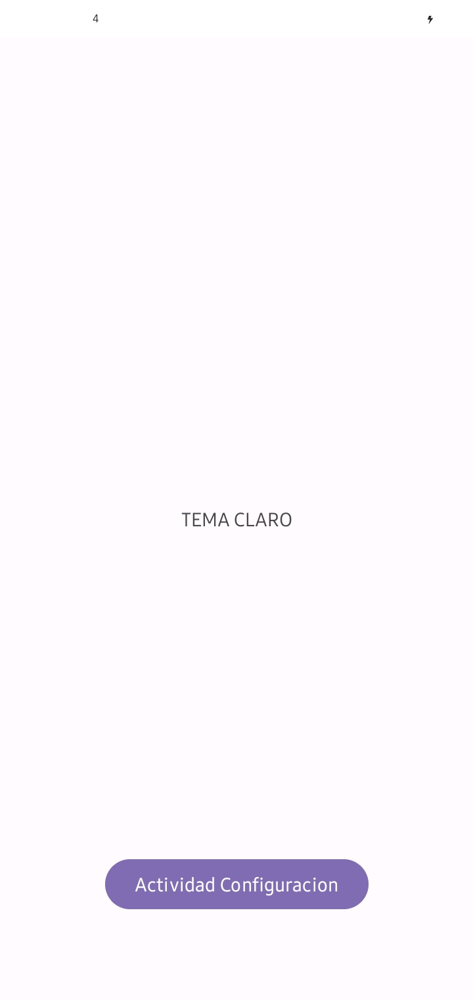
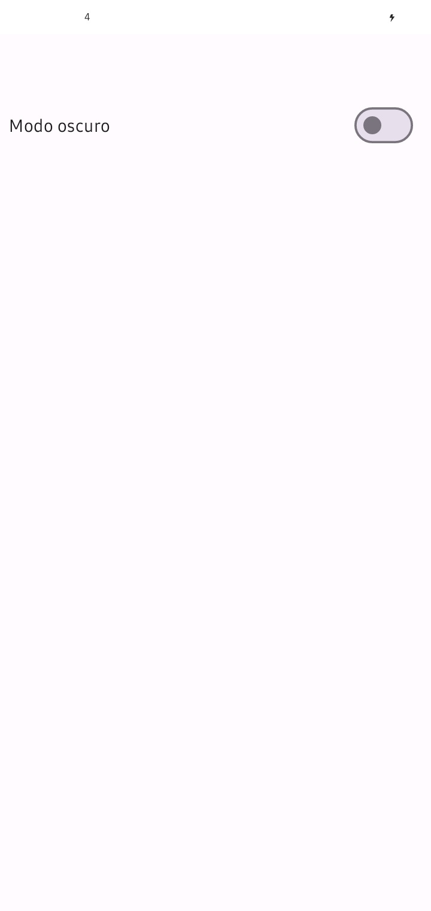
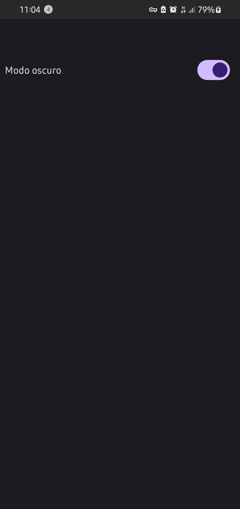
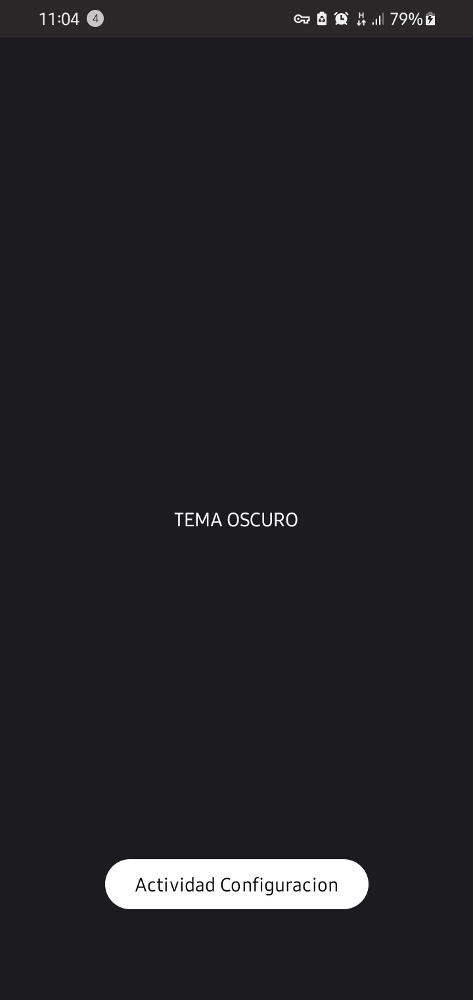

# Configuracion de tema claro y oscuro
Configura el tema de tu aplicacion con tema claro y oscuro y guarda el el estado del tema con SharedPreferences 

| Imagen 1 | Imagen 2 | Imagen 3 | Imagen 4 |
| -------- | -------- | -------- | -------- |
|  |  |  |  |

