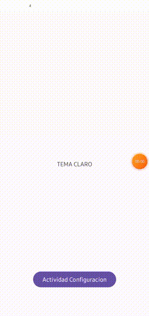

# Configuracion de tema claro y oscuro
Configura el tema de tu aplicacion con tema claro y oscuro y guarda el estado del tema con SharedPreferences 

| Imagen 1 | Imagen 2 | Imagen 3 | Imagen 4 |
| -------- | -------- | -------- | -------- |
|  |  |  |  |

# Demostracion
<p align="center">
  
</p>

# Estilo oscuro    /res/themes/themes.xml (night)

```html
<resources xmlns:tools="http://schemas.android.com/tools">
    <!-- Base application theme. -->
    <style name="Base.Theme.Tema" parent="Theme.Material3.Dark.NoActionBar">


        <item name="android:textColor">@color/white</item>
        <item name="android:statusBarColor">#292727</item>

    </style>


    <style name="diseño_boton" parent="Widget.Material3.Button">
       <item name="backgroundTint">@color/white</item>
        <item name="android:textColor">@color/black</item>
    </style>


</resources>
```


# Estilo Claro    /res/themes/themes.xml

```html

<resources xmlns:tools="http://schemas.android.com/tools">
    <!-- Base application theme. -->
    <style name="Base.Theme.Tema" parent="Theme.Material3.Light.NoActionBar">

        <!-- Customize your light theme here. -->
        <item name="backgroundTint">@color/white</item>

        <item name="android:statusBarColor">@color/white</item>

    </style>

    <style name="diseño_boton" parent="Widget.Material3.Button">
        <item name="backgroundTint">@color/black</item>
        <item name="android:textColor">@color/white</item>
    </style>

</resources>
```
# CODIGO CLASE MainActivity
```

public class MainActivity extends AppCompatActivity {


    Boolean  guarda_estado;

    SharedPreferences  sharedPreferences_leer;
    TextView textView;
    @Override
    protected void onCreate(Bundle savedInstanceState) {
        super.onCreate(savedInstanceState);
        setContentView(R.layout.activity_main);


        Button button_activity=findViewById(R.id.button);

         textView  =findViewById(R.id.textView);


button_activity.setOnClickListener(new View.OnClickListener() {
    @Override
    public void onClick(View view) {


        Intent hh = new Intent(MainActivity.this,MainActivity2.class);
        startActivity(hh);

    }
});


    }


    @Override
    protected void onResume() {
        super.onResume();


        sharedPreferences_leer =getSharedPreferences("guardar_tema", Context.MODE_PRIVATE);
        guarda_estado=sharedPreferences_leer.getBoolean("guarda_estado",false);


        if (guarda_estado == true) {


            AppCompatDelegate.setDefaultNightMode(AppCompatDelegate.MODE_NIGHT_YES);
            textView.setText("TEMA OSCURO");
        }
        if (guarda_estado == false) {

            AppCompatDelegate.setDefaultNightMode(AppCompatDelegate.MODE_NIGHT_NO);

            textView.setText("TEMA CLARO");
        }


    }


}

```

# CODIGO CLASE MainActivity2
```
public class MainActivity2 extends AppCompatActivity {


    SharedPreferences sharedPreferences_insertar;

    SharedPreferences sharedPreferences_leer;
    Boolean guarda_estado;


    @Override
    protected void onCreate(Bundle savedInstanceState) {
        super.onCreate(savedInstanceState);
        setContentView(R.layout.activity_main2);


        MaterialSwitch on = findViewById(R.id.switch_indeter);

        sharedPreferences_leer =getSharedPreferences("guardar_tema", Context.MODE_PRIVATE);
         guarda_estado=sharedPreferences_leer.getBoolean("guarda_estado",false);

        MaterialSwitch  on2=findViewById(R.id.switch_indeter);
        if (guarda_estado == true) {

            on2.setChecked(true);
        }
        if (guarda_estado == false) {

            on2.setChecked(false);

        }


        on.setOnCheckedChangeListener(new CompoundButton.OnCheckedChangeListener() {
            @Override
            public void onCheckedChanged(CompoundButton compoundButton, boolean activo) {

                sharedPreferences_insertar =getSharedPreferences("guardar_tema", Context.MODE_PRIVATE);
                SharedPreferences.Editor editor= sharedPreferences_insertar.edit();
                editor.putBoolean("guarda_estado",activo);


                if (activo == true) {


                    AppCompatDelegate.setDefaultNightMode(AppCompatDelegate.MODE_NIGHT_YES);
                }
                if (activo == false) {


                    AppCompatDelegate.setDefaultNightMode(AppCompatDelegate.MODE_NIGHT_NO);
                }


                editor.commit();
            }
        });

    }


}


```


# CODIGO PANTALLA MainActivity 

```
<?xml version="1.0" encoding="utf-8"?>
<androidx.constraintlayout.widget.ConstraintLayout xmlns:android="http://schemas.android.com/apk/res/android"
    xmlns:app="http://schemas.android.com/apk/res-auto"
    xmlns:tools="http://schemas.android.com/tools"
    android:layout_width="match_parent"
    android:layout_height="match_parent"
    tools:context=".MainActivity">

    <TextView
        android:id="@+id/textView"
        android:layout_width="wrap_content"
        android:layout_height="wrap_content"
        android:text="HOLA MUNDO"
        app:layout_constraintBottom_toBottomOf="parent"
        app:layout_constraintEnd_toEndOf="parent"
        app:layout_constraintStart_toStartOf="parent"
        app:layout_constraintTop_toTopOf="parent" />

    <Button
        android:id="@+id/button"
        style="@style/diseño_boton"
        android:layout_width="wrap_content"
        android:layout_height="wrap_content"
        android:text="Actividad Configuracion"
        app:layout_constraintBottom_toBottomOf="parent"
        app:layout_constraintEnd_toEndOf="parent"
        app:layout_constraintStart_toStartOf="parent"
        app:layout_constraintTop_toBottomOf="@+id/textView"
        app:layout_constraintVertical_bias="0.79" />

</androidx.constraintlayout.widget.ConstraintLayout>


```


# CODIGO PANTALLA MainActivity2 
```
<?xml version="1.0" encoding="utf-8"?>
<androidx.constraintlayout.widget.ConstraintLayout xmlns:android="http://schemas.android.com/apk/res/android"
    xmlns:app="http://schemas.android.com/apk/res-auto"
    xmlns:tools="http://schemas.android.com/tools"
    android:layout_width="match_parent"
    android:layout_height="match_parent"
    tools:context=".MainActivity2">


    <com.google.android.material.materialswitch.MaterialSwitch
        android:id="@+id/switch_indeter"
        android:layout_width="0dp"
        android:layout_height="wrap_content"
        android:layout_marginStart="8dp"
        android:layout_marginTop="8dp"
        android:layout_marginEnd="16dp"
        android:layout_marginBottom="675dp"
        android:layout_weight="1"
        android:text="Modo oscuro"
        app:layout_constraintBottom_toBottomOf="parent"
        app:layout_constraintEnd_toEndOf="parent"
        app:layout_constraintStart_toStartOf="parent"
        app:layout_constraintTop_toTopOf="parent"
        app:layout_constraintVertical_bias="1.0" />

</androidx.constraintlayout.widget.ConstraintLayout>


```


